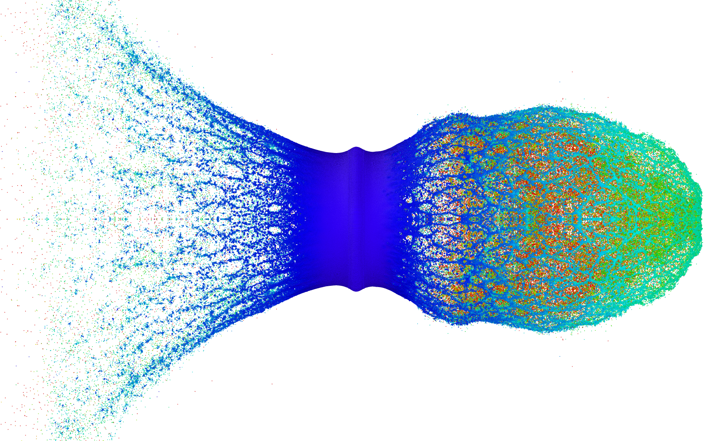

# sigmaSPH



*The debris cloud of an Al 2017-T4 sphere that has perforated a 2 mm Al 2017-T4 disc at
6.7 km/s, computed with the scene `data/scenes/hvi_3d_quarter_al2017.json` included
below.*

sigmaSPH is a GPU-accelerated Smoothed Particle Hydrodynamics (SPH) code written in
[Taichi](https://taichi-lang.org/). It simulates weakly compressible fluids with δ⁺-SPH,
and hypoelastic–plastic solids at large deformation on the same machinery. All kernels
are JIT-compiled, so one source tree runs on CUDA, Vulkan, Metal or the CPU. The code
works in 3D throughout. A 2D plane-strain problem is a single particle layer with a
plane-strain constraint, not a separate code path, and axisymmetric problems are solved
in the (x, r) half-plane.

On the solid side, the code has:
- linear, Tait, Mie–Grüneisen, JWL and Holmquist–Johnson–Cook equations of state;
- J2 plasticity with linear or Johnson–Cook hardening;
- Johnson–Cook, Cocks–Ashby, Holmquist–Johnson–Cook and Grady–Kipp damage;
- ALE particle shifting with conservative transport of the particle-carried state;
- an hourglass stabiliser;
- displacement-controlled grips with force recording.

The theory and user manual is
[`documentation/manual.pdf`](documentation/manual.pdf). It covers the continuum
formulations, the SPH discretisation, the material models and the complete scene-file
keyword reference.

This repository is a release channel: each commit is the snapshot of one release. Its
history is the list of releases, not the development history.

## Installation

sigmaSPH needs Python 3.11 or later (on 3.10, also install `tomli`), with Taichi, NumPy
and SciPy. The force–displacement plotting script also needs Matplotlib:

```bash
mamba create -n taichi python=3.11 numpy scipy matplotlib
mamba activate taichi
python -m pip install taichi
```

Writing the binary trajectory format (`"Output": {"netcdf": true}`) also needs `netCDF4`.
Install it with pip (`python -m pip install netCDF4`), not with conda. pip's wheels bundle
their own netCDF and HDF5 libraries and leave the rest of the environment alone. A scene
that does not ask for NetCDF output runs without the package.

## Running a scene

```bash
python run_simulation.py --scene_file data/scenes/<scene>.json
python run_simulation.py --scene_file data/scenes/<scene>.json --no-gui
```

A run opens a window by default. Add `--no-gui` to run without the window, the camera
and the visualisation buffers; the time loop, the status line, the output files and the
closing energy and momentum summary stay the same. Scene files are JSON with `#`
comments, or TOML. Every key is checked against a parameter registry when the file is
loaded, so a misspelt or misplaced key is an error, not something silently ignored.

## Included scenes

All three scenes use the unit system mm, GPa, ms (density in kg/mm³, velocity in
mm/ms = m/s).

| scene | what it is |
|---|---|
| `data/scenes/tensile_axi_dogbone_nofail_dx0.1.json` | an axisymmetric round-bar dogbone of stainless steel (Ø10 mm heads, Ø6 mm gauge) pulled in tension by displacement-controlled grips, with Johnson–Cook strength and no damage, at particle spacing 0.1 mm. The grip forces go to `<scene>_constraints.csv`, which `tools/plot_force_displacement.py --scene tensile_axi_dogbone_nofail_dx0.1` turns into a force–displacement curve. |
| `data/scenes/hvi_3d_quarter_al2017.json` | a 6.35 mm Al 2017-T4 sphere into a 2 mm Al 2017-T4 disc at 6.7 km/s, on a Mie–Grüneisen shock EOS, as a 3D quarter model with mirror planes at y = 0 and z = 0. Two mirror planes admit only the azimuthal modes m = 0, 4, 8, …, so the fragmentation pattern is filtered by construction. |
| `data/scenes/hvi_3d_quarter_al_concrete150_chocron_gk_mm_GPa_ms.json` | a 25.4 mm aluminium sphere into a 150 MPa concrete plate (Ø300 × 24 mm) at 2 km/s, after Chocron et al. (2019) and Kim et al. (2025): Holmquist–Johnson–Cook concrete with the Grady–Kipp tension card, as a 3D quarter model at 1 mm spacing, about 426,000 particles. This is a large run. On one GPU it took about an hour and wrote 7.8 GB of NetCDF output. |

The comments at the top of each scene file explain its parameters. Some comments
refer to documents and analysis scripts that are not part of this release.

## Licence

MIT. See `LICENSE`.

## Author

Georg C. Ganzenmüller ([ORCID 0000-0001-5741-8844](https://orcid.org/0000-0001-5741-8844)),
georg.ganzenmueller@inatech.uni-freiburg.de

- Institute of Sustainable Systems Engineering (INATECH), University of Freiburg,
  Georges-Köhler-Allee 401A, 79110 Freiburg, Germany
- Fraunhofer Institute for High-Speed Dynamics, Ernst-Mach-Institut, EMI,
  Ernst-Zermelo-Str. 4, 79104 Freiburg, Germany
